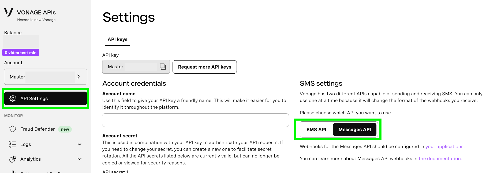
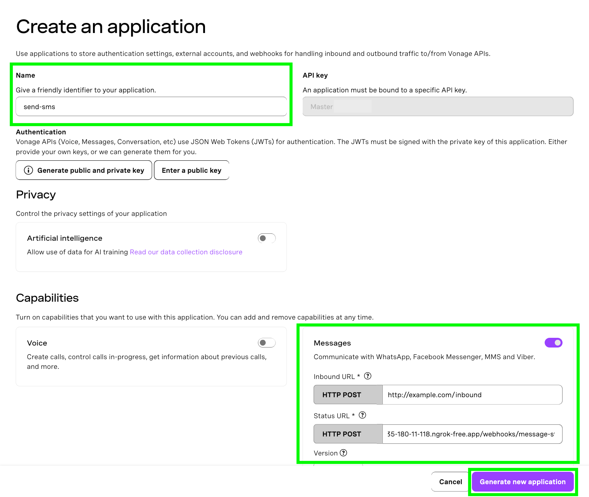
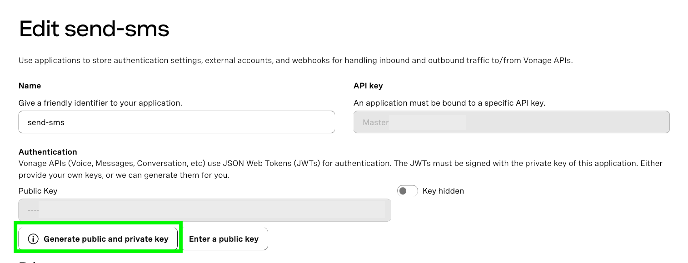
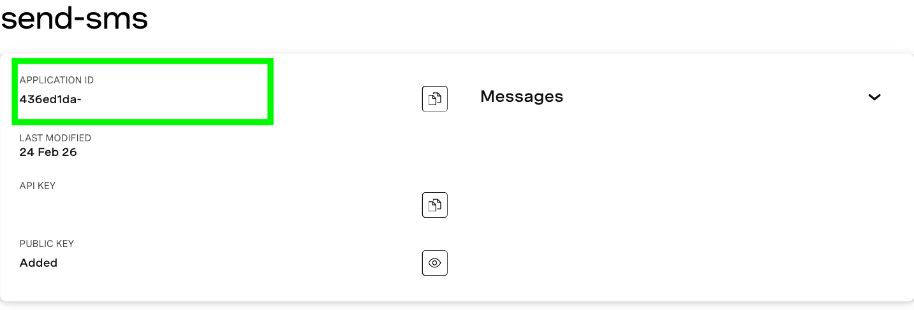
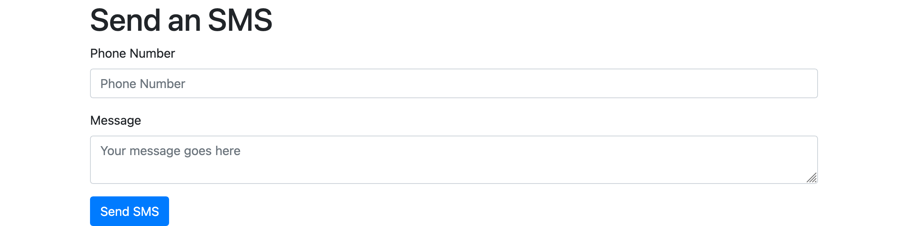
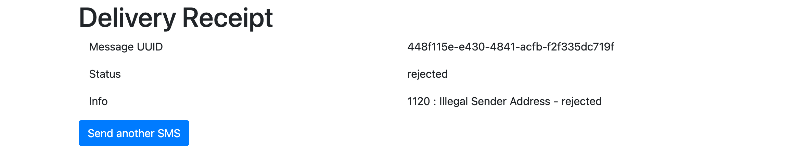

# Send SMS Messages With Python, Flask and Vonage

This repo uses the [Vonage Messages API](https://developer.vonage.com/en/messages/overview) to send an SMS with a Python Flask app.

Learn more about the Messages API with this tutorial. The tutorial goes into more detail about the example code in this repo and provides supplemental information to help you out. TODO: Add link once published

**Please note:** Because of different SMS regulations around the world, you may receive an error code from Vonage when attempting to send an SMS from a Vonage virtual number. You can [view logs in the developer dashboard](https://dashboard.vonage.com/messages/logs) by selecting “Logs” from the navigation on the left. To learn more about SMS regulations – especially if you’re using a 10 digit US number – refer to this blog post about [what you need to know about 10DLC](https://developer.vonage.com/en/blog/what-you-need-to-know-about-10dlc).

# How To Get This Code Running

## Prerequsites
- Python 3.8+
- A [Vonage API account](https://ui.idp.vonage.com/ui/auth/registration)
- An [ngrok account and installation](https://developer.vonage.com/en/blog/local-development-nexmo-ngrok-tunnel-dr/)

## Setup
### Create an account with ngrok, install it, and spin up a tunnel

The Voice API must be able to access your webhook so that it can make requests to it, therefore, the endpoint URL must be accessible over the public internet.

In order to do that for this tutorial, [we will use ngrok](https://developer.vonage.com/en/blog/local-development-nexmo-ngrok-tunnel-dr/).

Once you have ngrok installed, open up a terminal window and run:

```
ngrok http 5000
```

This command will generate the public URLs your local server will tunnel to on port 5000. Take note of the public URL because we will be using it when we create our Vonage application – it should look something like this:

```
Forwarding                	https://4647-135-180-11-118.ngrok-free.app -> http://localhost:5000
```

**Please note:** Unless you are using one of ngrok’s paid plans, the generated public URLs are not persistent. In other words, every time you run the `ngrok` command, the resulting URLs will change and you will have to update your Vonage application configuration. To prevent this, leave ngrok running in the background.

### Create a Vonage account, purchase a number, and make sure you’re using the right API

You will need a [Vonage API account](https://ui.idp.vonage.com/ui/auth/registration) and a virtual phone number. You can purchase a number from the [developer dashboard](https://dashboard.vonage.com/numbers/buy-numbers). Make sure to buy a number in your country code and with SMS and MMS features.

Since we will be using the Messages API, you will also need to configure your account settings accordingly. From the left hand navigation in the developer dashboard, select API Settings. In the SMS settings section, select Messages API and complete the accompanying prompts to save your changes.



### Create a Messages API application and link your number to it

Create your Messages API application in the developer dashboard by navigating to the Applications window from the left hand menu and clicking the Create new application button. This will open the application creation menu. Give your application the name `send-sms`.

Under the Capabilities section, toggle the option for Messages, which will reveal a list of text fields. In the text field labeled Status URL, provide the ngrok public URL amended with the webhook we will define in the Flask app. It will look something like this:

```
https://0a6ec0a950eb.ngrok-free.app/webhooks/message-status
```

For the Inbound URL, you can just use `http://example.com/inbound` since we won’t be using this webhook for this particular demo.

Click the Generate new application button.



Now that your application has been created, you can link your number to it by clicking on the Link button in the table of available numbers. Make sure to select a number with SMS and MMS features. Your application is now ready to answer inbound calls.

## Run the code

### 1. Create and activate a Python virtual environment

```
python3 -m venv venv && source venv/bin/activate
```
### 2. Install dependencies
```
pip install -r requirements.txt
```
### 3. Generate and add your application ID and private key to your environment variables

In the developer dashboard [Applications menu](https://dashboard.vonage.com/applications), click on the `send-sms` application and then click Edit. Once the edit window opens, click on the button that says, “Generate public and private key.” This will trigger a download of your private key as a file with the extension `.key`. Keep this file private and do not share it anywhere it could be compromised.

Click on the Save changes button and also note your Application ID.





Move your private key file to your project directory and update the `.env_template` file with your application ID. Then update the name of the file to `.env`.

### 4. Run the app

In the same directory as the `app.py` file, run:

```
flask run
```

This will spin up a server on `http://127.0.0.1:5000`. Navigate to that location in a web browser and you should see something like this:



### 5. Try it out!

Fill out the form with the phone number (with country code) that you wish to receive a text to along with a message to send.

Depending on your region’s SMS regulations, you will receive a text message from your Vonage virtual number using the information you provided in the form. However, because different country regulations may restrict sending an SMS from a Vonage virtual number, regardless of whether or not the message is successful, the Flask app will produce a real time delivery receipt from Vonage.



